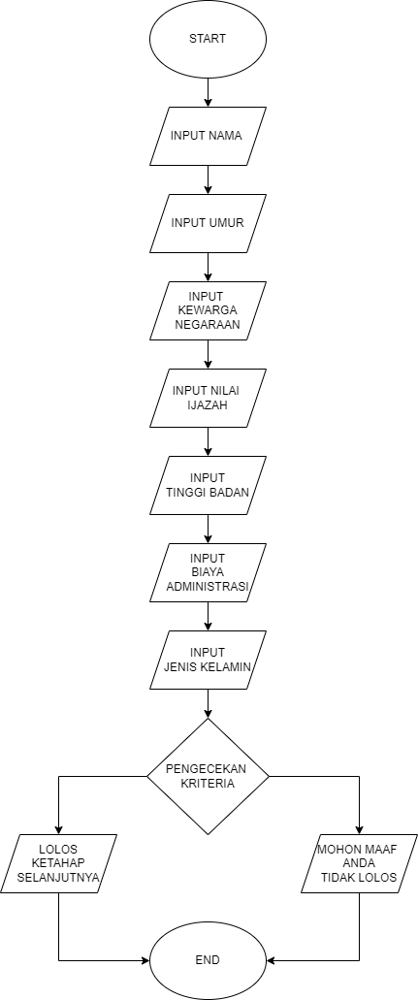

# PROGRAM
SELEKSI ADMINISTRASI REKRUTMEN POLSUSKA PRIA TINGKAT SLTA TAHUN 2024 PT KAI
## STUDI KASUS
Dalam seleksi penerimaan POLSUSKA PRIA TINGKAT SLTA PT KAI terdapat test/seleksi tahap pertama yang akan dihadapi peserta yaitu seleksi administrasi,pada tahap ini peserta harus memenuhi syarat ketentuan agar bisa lolos ke tahap selanjutnya,berikut adalah data yang harus diinput:
1.Nama
2.Umur
3.Kewarganegaraan
4.Nilai ijazah SLTA
5.Tinggi badan
6.Biaya administrasi
7.Jenis kelamin

kriteria
Umur < 28
Kewarganegaraan = Indonesia
Nilai >= 8.0
Tinggi badan >= 170
Biaya administrasi = 150.000
Jenis kelamin = Pria

## FLOWCHART

